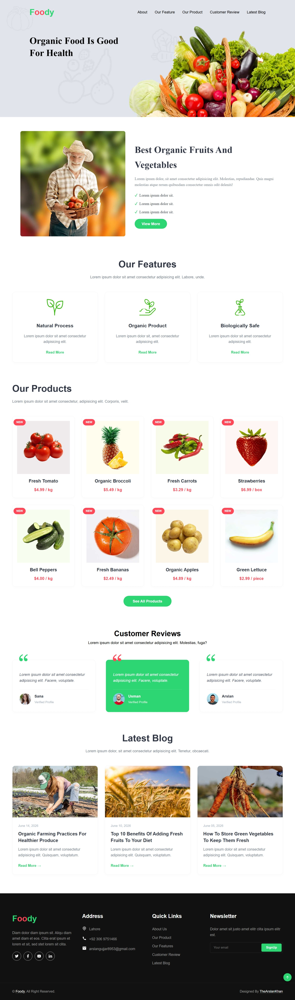
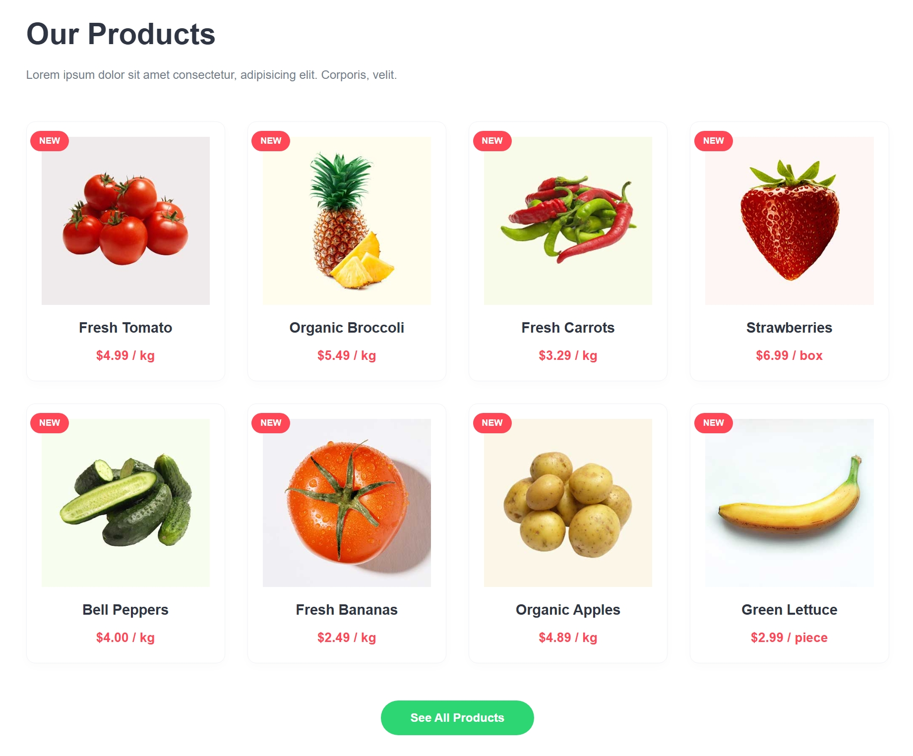
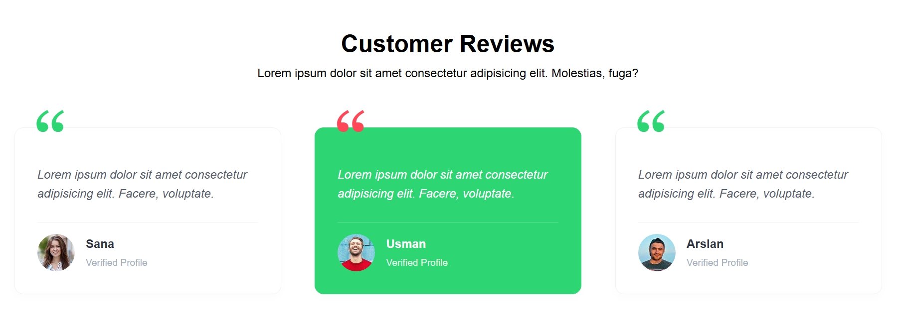

# foody-organic-food-website

A modern and responsive organic food landing page built using HTML5 and CSS3. The project showcases multiple website sections including About, Features, Products, Customer Reviews, Blog Posts, and a fully designed Footer.

---

## Project Preview

### Homepage

### Products Section

### Customer Reviews

---

## Description

Foody is a modern organic food website designed to promote healthy eating and fresh organic products.

The website features a clean and professional user interface with multiple sections commonly found in real-world business websites. It includes product showcases, feature highlights, customer testimonials, blog articles, and a detailed footer section.

This project was built to practice advanced HTML and CSS concepts such as Flexbox, CSS Grid, responsive layouts, hover effects, positioning, and component-based page design.

---

## Features

* Responsive navigation bar
* Hero banner section
* About section
* Features section
* Product showcase section
* Product badges
* Customer reviews section
* Blog section
* Newsletter subscription form
* Social media links
* Contact information section
* Smooth hover effects
* Scroll-to-top button
* Modern footer design
* Responsive layout structure

---

## Technologies Used

* HTML5
* CSS3

---

## HTML Concepts Practiced

This project focuses on:

* Semantic HTML
* Navigation Menus
* Header and Footer Structure
* Sections and Containers
* Images
* Buttons
* Lists
* Forms
* Input Fields
* Anchor Links
* SVG Icons
* Accessibility Attributes

---

## CSS Concepts Practiced

This project focuses on:

* Flexbox
* CSS Grid
* Positioning
* Box Model
* Responsive Layouts
* Hover Effects
* Transitions
* Border Radius
* Box Shadows
* Typography Styling
* Custom Buttons
* Image Handling
* Component Styling

---

## Website Sections

### Hero Section

A visually appealing banner introducing the organic food brand with a strong heading and call-to-action design.

### About Section

Highlights the benefits of organic fruits and vegetables with supporting content and imagery.

### Features Section

Showcases key business features:

* Natural Process
* Organic Products
* Biologically Safe

### Products Section

Displays featured organic products including:

* Tomatoes
* Broccoli
* Carrots
* Strawberries
* Bell Peppers
* Bananas
* Apples
* Lettuce

Each product includes:

* Product image
* Product name
* Price
* New badge

### Customer Reviews

Displays customer testimonials using modern review cards with profile information.

### Blog Section

Contains featured blog articles related to:

* Organic farming
* Healthy eating
* Fresh produce
* Food storage tips

### Footer Section

Includes:

* Company information
* Contact details
* Quick links
* Newsletter subscription
* Social media links
* Copyright section

---

## Project Structure

foody-organic-food-website/
│
├── index.html
├── style.css
│
├── img/
│ ├── about.jpg
│ ├── carousel-1.jpg
│ ├── product-1.jpg
│ ├── product-2.jpg
│ ├── product-3.jpg
│ ├── product-4.jpg
│ ├── product-5.jpg
│ ├── product-6.jpg
│ ├── product-7.jpg
│ ├── product-8.jpg
│ ├── testimonial-1.jpg
│ ├── testimonial-2.jpg
│ ├── testimonial-3.jpg
│ ├── blog-1.jpg
│ ├── blog-2.jpg
│ └── blog-3.jpg
│
├── screenshot/
│ ├── homepage-preview.jpeg
│ ├── products-preview.jpeg
│ └── reviews-preview.jpeg
│
└── README.md

---

## Learning Outcomes

By building this project, students will learn:

* How to structure a complete multi-section website
* How to build responsive layouts using Flexbox and Grid
* How to create reusable card components
* How to design product showcase sections
* How to organize large CSS files
* How to improve user experience with animations and hover effects
* How professional landing pages are structured

---

## Future Improvements

Possible enhancements include:

* Mobile navigation menu
* Dark mode support
* JavaScript interactions
* Product filtering system
* Shopping cart functionality
* Backend integration
* Contact form functionality
* Animations on scroll

---

## Author

Created as part of front-end web development practice to strengthen HTML, CSS, responsive design, and UI development skills.
